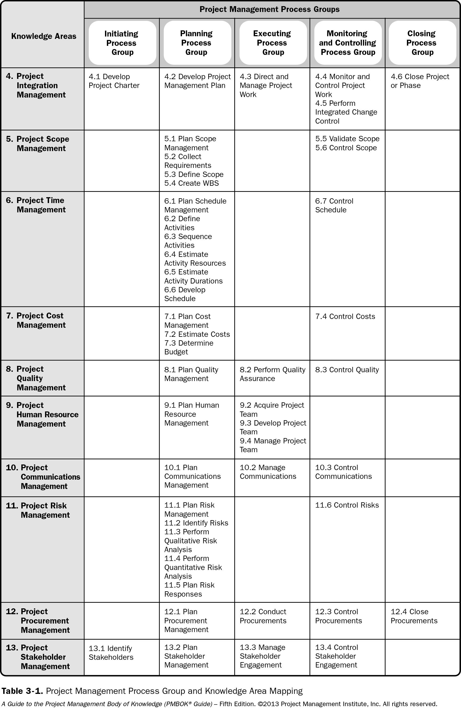

# Project Management Cheat Sheet

**Project management** is the practice of initiating, planning, executing, controlling, and closing the work 
of a team to achieve specific goals and meet specific success criteria at the specified time.

### Table of Contents

- [Introduction](#Introduction)
- [Knowledge Areas](#knowledge-areas)
  - [Integration](#integration)
  - [Stakeholder](#stakeholder)
  - [Scope](#scope)
  - [Quality](#quality)
- [Resources](#resources)

## Introduction

**Project** - a unique and temporary endeavour that has a defined beginning and end, 
undertaken to create a specific product, service or result.

**Project Constraints** - limitations on what you do, how you do it and when you do it: 
  - Time constraint - time period within which you are to produce an end product or service. 
  - Money - amount of money and other resources allocated to your project. 
  - Scope - what the project accomplishes.
  
**Project Organizations**
  - Functional Organization - manager has responsibilities over specific function 
  (e.g. Marketing, Operations, Finance). Used for simple projects.
  - Matrix Organization
    - Weak - functional manager has more power and control than project manager
    - Balanced - functional manager and project manager both have power and control
    - Strong - project manager has more power than functional manager
  - Projectized Organization - project manager has all power and responsibilities. Team members are assigned to a single project. More expensive.
  

## Knowledge Areas

**PMBOK (Project Management Body of Knowledge)** has been developed by **PMI (Project Management Institute)** 
to promote generally recognized good practices in project management. 

PMBOK guide describes 10 **Project Management Knowledge Areas**:
  - Integration - processes and activities needed to coordinate other processes and activities whithin PM process groups
  - Scope - processes required to ensure that the project includes all the work required, 
  and only the work requred, the complete the project
  - Time - processes required to accomplish timely completion of the project
  - Cost - processes involved in planning, budgeting and controlling costs so that the project can be completed 
  within bidget
  - Quality - processes that determine quality policies so that the project will satisfy the needs for which 
  it was undertaken
  - HR - processes that organize and manage the project team
  - Communications - processes required for generation, collection and distribution of project information
  - Risk - processes concerned with conducting risk management
  - Procurement - processes to purchase or acquire products, services or results needed
  from outside the project team to perform the work
  - Stakeholder - processes to identify people, groups and organizations, that could impact or be impacted by the 
  project, to analyze stakeholder expectations and their impact on the project to develop appropriate strategies 
  for effectively engaging stakeholders in project execution.
  
PMBOK Introduction to Project Management Lesson 
https://s3-us-west-2.amazonaws.com/unex-pm-mooc/lesson01/story_html5.html

### Integration

PMBOK Project Integration and Project Scope Management Lesson 
https://s3-us-west-2.amazonaws.com/unex-pm-mooc/lesson02/story_html5.html

### Stakeholder

**Stakeholder** - a person, group or organization who may affect, be affected by, or perceive itself to be 
affected by a decision, activity, or outcome of a project. Examples of stakeholders:
  - Team members
  - Customers
  - Sponsors
  - Vendors
  
Categorization of stakeholders:
  
|                  | **Low Interest**    | **High Interest** |
| ---              | ---                 | ---               |
| **Low Power**    | Monitor             | Keep Informed     |
| **High Power**   | Keep Satisfied      | Manage Closely    |

PMBOK Stakeholder Management Lesson https://s3-us-west-2.amazonaws.com/unex-pm-mooc/lesson10/story_html5.html

### Scope

**Project Charter** - the document that formally announces the project and grants the project manager the authority to 
use organizational resources to meet project objectives.

**Project Management Plan** should include:
  - Scope
    - what the project does accomplish and does not accomplish
    - Who approves this
    - Once approved, can it be changed?
  - Schedule
    - Are there guidelines
    - What software to be used
    - How often to be maintained
    - Who makes changes to it
  - Cost
    - Are there guidelines
    - Who approves the budget
    - What to do if you are under or over budget
    - Can you ask for more money and who do you ask
    - What type of budget reporting will you do
    
**WBS (Work Breakdown Structure)** - depicts the work that is necessary to meet project objectives. 
It is the foundational planning tool for the project. Based on the scope and helps to define the scope.

PMBOK Project Integration and Project Scope Management Lesson 
https://s3-us-west-2.amazonaws.com/unex-pm-mooc/lesson02/story_html5.html

#### Authority vs Influence

Conflict resolution:
  - **Confronting** (problem solving or collaboration). Finds a solution that is best for the project, 
  but not necessarily best for one party or another.
  - **Compromising** - take ideas from each party so that the solution is a little bit of each. 
  May not necessarily result in the best approach.
  - **Smoothing** (accommodating) - you seek to remind the parties in conflict  of their similarities.
  - **Forcing** (competing) - you simply tell people how it will be.
  - **Avoiding** - good when you are outranked.
  
### Quality

**Prevention Over Inspection** -it is better to stop a defect from occurring. If you cannot do that, it is better to find the defect 
before your customer does and of course if your customer finds a defect, your quality process might not 
be working! 

**Plan Quality Management** - the process of identifying quality requirements and/or standards and
documenting how the project will demonstrate compliance. It should result in quality metrics, quality
checklists, process improvement plan.

**Product Quality** focuses on the goods and services. 
**Project Quality** focuses on the project management processes.

**Cost of Quality**:
  - **Cost of Conformance** - money spent during the project to avoid failures
    - Prevention Costs (Training, Documenting, Equipment, Time to do it right)
    - Inspection Costs (Testing, Inspections)
  - **Cost of Nonconformance** - moeny spent during and after the project because of failures
    - Internal Failure Cost (Bug fixing)
    - External Failure Cost (Liabilities, Warranty work, Lost business)
    
PMBOK Quality Management Lesson
https://s3-us-west-2.amazonaws.com/unex-pm-mooc/lesson05/story_html5.html

## Resources

- Initiating and Planning Projects https://www.coursera.org/learn/project-planning

